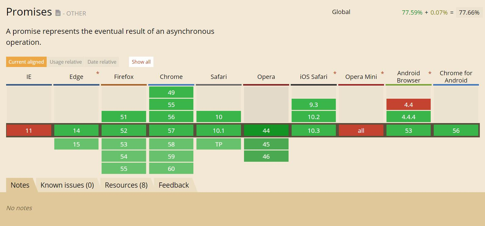

# Promise? <br>Promise.

[@meathill](https://weibo.com/meathill)

<!-- page -->

### 关于作者

<!-- section -->


全栈工程师，编程爱好者

[博客](http://blog.meathill.com/)

<!-- page -->

> ['prɒmɪs]

> n. 许诺，允诺；希望

<!-- page -->

> The Promise object is used for asynchronous computations.

> A Promise represents a value which may be available now, or in the future, or never.

> --[MDN](https://developer.mozilla.org/en-US/docs/Web/JavaScript/Reference/Global_Objects/Promise)

<!-- section -->

> Promise 对象用于异步计算。

> 一个 Promise 表示一个现在、将来或永不可能可用的值。

<p class="fragment">

</p>

<!-- page -->

### Promise 对象

* 用于异步计算。
* 代表一个值，
* 这个值可能现在就可以用；
* 也可能将来才可以用;
* 甚至永远不会存在。

<p class="fragment fue">

</p>

Note:
4. （正在加载）
5. （但不耽误我们写别的）

<!-- section -->

## Promise 对象

* 主要用于异步计算。
* 可以帮将异步操作队列化，<br>按照期望的顺序执行，<br>返回符合预期的结果。
* 可以在对象之间传递和操作 Promise。

<!-- page -->

## 为什么会有 Promise？

1. JavaScript 为检查表单而生。
2. 创造它的首要目标是操作 DOM。
3. 所以，JavaScript 的操作大多是异步的。

Note:
3. (作为一门 UI 语言，界面冻结是大忌)

<!-- section -->

### 有了 Node.js 之后

情况进一步加剧了……

1. 无阻塞高并发，是 Node.js 的招牌。
2. 异步操作是其保障。
3. 大量操作依赖回调函数。

<!-- section -->

稍有不慎，就会踏入“回调地狱”。


<!-- page -->

假设需求：

遍历目录，找出最大的一个文件。

<!-- section -->
```javascript
function findLargest(dir, callback) {
  fs.readdir(dir, function (err, files) {
    if (err) return callback(err);
    let count = files.length; // [1]
    let errored = false;
    let stats = [];
    files.forEach( file => {
      if (errored) return; // [2]
      fs.stat(path.join(dir, file), (err, stat) => {
        if (err) {
          errored = true;
          return callback(err);
        }
        stats.push(stat); // [3]
        
        if (--count === 0) { // [4]
          let largest = stats
            .filter(function (stat) { return stat.isFile(); })
            .reduce(function (prev, next) {
              if (prev.size > next.size) return prev;
              return next;
            });
          callback(null, files[stats.indexOf(largest)]);
        }
      });      
    });    
  });
}

findLargest('./path/to/dir', function (err, filename) {
  if (err) return console.error(err);
  console.log('largest file was:', filename);
});
```

<!-- page -->

回调有三个问题：

1. 嵌套层次很深，难以维护
2. 无法正常使用 `return` 和 `throw`
3. 无法正常检索堆栈信息
4. 多个回调之间难以建立联系

<!-- page -->

社区经过长时间探索，最终总结出：

## Promise

1. 可以很好的解决回调嵌套问题
2. 代码阅读体验很好
3. 不需要新的语言特性

<!-- page -->

## Promise 详解

<!-- section -->

```javascript
new Promise(
  /* 执行器 executor */
  function (resolve, reject) {
    // 一段耗时很长的异步操作
    
    resolve(); // 数据处理完成

    reject(); // 数据处理出错
  }
)
  .then(function A() { 
    // 成功，下一步
  }, function B() {
    // 失败，做相应处理
  });
```

Note:
正所谓“我不入地狱谁入地狱”，Promise 使用回调解决了回调……

<!-- section -->

1. Promise 是一个 **代理对象**，它和原先的操作并无关系。
2. Promise 有3个状态：
    1. `pending` [待定] 初始状态
    2. `fulfilled` [实现] 操作成功
    3. `rejected` [被否决] 操作失败
3. Promise 实例一经创建，执行器立即执行。
4. Promise 状态发生改变 ，就会触发 `.then()` 执行后续步骤。
5. Promise 状态一经改变，不会再变。

<!-- page -->

接下来，看一个简单的范例

### 定时执行

```
./sample/timeout.js
```

<!-- page -->

再看一个

### 分两次，顺序依次执行

```
./sample/timeout2.js
```

<!-- page -->

假如在 `.then()` 的函数里面不返回新的 Promise，会怎样？

```
./sample/timeout3.js
```

<!-- page -->

## `.then()`

1. `.then()` 接受两个函数作为参数，分别代表 `fulfilled` 和 `rejected`
2. `.then()` 返回一个新的 Promise 实例，所以它可以链式调用
2. 当前面的 Promise 状态改变时，`.then()` 根据其最终状态，选择特定的状态响应函数执行
3. 状态响应函数可以返回新的 Promise，或其它值
4. 如果返回新的 Promise，那么下一级 `.then()` 会在新 Promise 状态改变之后执行
5. 如果返回其它任何值，则会立刻执行下一级 `.then()`

<!-- page -->

### `.then()` 里有 `.then()` 的情况

因为 `.then()` 返回的还是 Promise 实例。

会等里面的 `.then()` 执行完，在执行外面的。

对于我们来说，此时最好将其展开，会更好读。

```
./sample/nested-then.js
```

<!-- page -->

问题：下面的四种 promises 的区别是什么

```javascript
// #1
doSomething().then(function () {
  return doSomethingElse();
});

// #2
doSomething().then(function () {
  doSomethingElse();
});

// #3
doSomething().then(doSomethingElse());

// #4
doSomething().then(doSomethingElse);
```

<!-- page -->

```javascript
doSomething()
  .then(function () {
    return doSomethingElse();
  });
```

答案：

```
doSomething
|-----------|
            doSomethingElse(undefined)
            |------------|
                         finalHandler(resultOfDoSomethingElse)
                         |------------|
```

<!-- section -->

```javascript
doSomething()
  .then(function () {
    doSomethingElse();
  })
  .then(finalHandler);
```

答案：

```
doSomething
|-----------------|
                  doSomethingElse(undefined)
                  |------------------|
                  finalHandler(undefined)
                  |------------------|
```

<!-- section -->
```javascript
doSomething()
  .then(doSomethingElse())
  .then(finalHandler);
```

答案：

```
doSomething
|-----------------|
doSomethingElse(undefined)
|---------------------------------|
                  finalHandler(resultOfDoSomething)
                  |------------------|
```

<!-- section -->

```javascript
doSomething()
  .then(doSomethingElse)
  .then(finalHandler);
```

答案：

```
doSomething
|-----------|
            doSomethingElse(resultOfDoSomething)
            |------------|
                         finalHandler(resultOfDoSomethingElse)
                         |------------------|
```

<!-- section -->

注：以上4道题及答案均来自<br> [We have a problem with promises](https://pouchdb.com/2015/05/18/we-have-a-problem-with-promises.html)

<!-- page -->

## 错误处理

Promise 会自动捕获内部异常，并交给 `rejected` 响应函数处理。

```
./sample/error.js
./sample/error-reject.js
```

<!-- section -->

通常有两种做法：

1. `reject('错误信息')`<br>`.then(null, message => {})`
2. `throw new Error('错误信息')`<br>`.catch( message => {})`

我推荐使用第二种，更加清晰，更加好读，并且可以捕获前面的错误。

<!-- section -->

来看一个稍微复杂一些的，捕获错误的范例：

### `.catch()` + `.then()`

```
./sample/catch-then.js
```

<!-- section -->

> <i class="fa fa-warning"></i> 注意：强烈建议在所有队列最后都加上 `.catch()`，以避免漏掉错误处理造成意想不到的问题。

```javascript
doSomething()
  .doAnotherThing()
  .doMoreThing()
  .catch( err => {
    console.log(err);
  });
```

<!-- page -->

## 批量执行

`Promise.all()`

<!-- section -->

`Promise.all([p1, p2, p3, ....])` 用于将多个 Promise 实例，包装成一个新的 Promise 实例。

1. 它接受一个数组作为参数
2. 数组里可以是 Promise 对象，也可以是别的值，只有 Promise 会等待状态改变
3. 当所有子 Promise 都完成，该 Promise 完成，返回值是全部值的数组
4. 有任何一个失败，该 Promise 失败，返回值是第一个失败的子 Promise 的结果

```
./sample/all.js
```

<!-- page -->

`Promise.all()` 最常见就是和 `.map()` 连用。

我们改造一下前面的例子。

```
./sample/map.js
```

<!-- page -->

## 实现队列

有时候我们不希望所有动作一起发生，而是按照一定顺序，逐个进行。

```javascript
let promise = doSomething();
promise = promise.then(doSomethingElse);
promise = promise.then(doSomethingElse2);
promise = promise.then(doSomethingElse3);
....
```

<!-- section -->

### 使用 `.forEach()`

```javascript
function queue(things) {
  let promise = Promise.resolve();
  things.forEach( thing => {
    promise = promise.then( () => {
      return new Promise( resolve => {
        doThing(thing, () => {
          resolve();
        });
      });
    });
  });
  return promise;
}

queue(['lots', 'of', 'things', ....]);
```
<!-- section -->

### 使用 `.reduce()`

```javascript
function queue(things) {
  return things.reduce( (promise, thing) => {
    return promise.then( () => {
      return new Promise( resolve => {
        doThing(thing, () => {
          resolve();
        });
      });
    });
  }, Promise.resolve());
}

queue(['lots', 'of', 'things', ....]);
```

<!-- section -->

两个常见错误：

```javascript
....
  things.forEach( thing => {
    promise.then( () => {
      return new Promise( resolve => {
        doThing(thing, () => {
          resolve();
        });
      });
    });
  });
....
```

<small class="fragment">没有把 `.then()` 产生的新 Promise 实例赋给 `promise`，没有生成队列。</small>

<!-- section -->

```javascript
function queue(things) {
  return things.reduce( (promise, thing) => {
    let step = new Promise( resolve => {
      doThing(thing, () => {
        resolve();
      });
    });
    return promise.then( step );
  }, Promise.resolve());
}
```

<small class="fragment">Promise 实例创建之后，会立刻运行执行器代码，所以这个也无法达成队列的效果。</small>

<!-- page -->

假设需求：

开发一个爬虫，抓取某网站。

<!-- section -->

```javascript
let url = ['http://blog.meathill.com/'];
function fetchAll(urls) {
  let promise = Promise.resolve();
  urls.reduce((promise, url) => {
    return promise.then( () => {
      return fetch(url);
    });
  }, promise);
}
function fetch(url) {
  return spider.fetch(url)
    .then( content => {
      return saveOrOther(content);
    })
    .then( content => {
      let links = spider.findLinks(content);
      return fetchAll(links);
    });
}
fetchAll(url);
```

<!-- section -->

### 进阶：使用 Generator 遍历

关于 Generator 的详情，请参阅[相关文档](https://developer.mozilla.org/zh-CN/docs/Web/JavaScript/Reference/Global_Objects/Generator)。

简而言之，

> Generator 可以在执行中中断，并等待唤起。

<!-- section -->
```javascript
let generator = function* (urls) {
  let loaded = [];
  while (urls.length > 0) {
    let url = urls.unshift();
    yield spider.fetch(url)
      .then( content => {
        loaded.push(url);
        return saveOrOther(content);
      })
      .then( content => {
        let links = spider.findLinks(content);
        links = _.without(links, loaded);
        urls = urls.concat(links);
      });
  }
  return 'over';
};

function fetch(urls) {
  let iterator = generator();
  
  function next() {
    let result = iterator.next();
    if (result.done) {
      return result.value;
    }
    let promise = iterator.next().value;
    promise.then(next);
  }
   
  next();
}

let urls = ['http://blog.meathill.com'];
fetch(urls)
```

<!-- page -->

## `Promise.resolve()`

1. 参数为空，返回一个状态为 `fulfilled` 的 Promise 实例
2. 参数是一个跟 Promise 无关的值，同上，不过 `fulfuilled` 响应函数会得到这个参数
3. 参数为 Promise 实例，则返回该实例，不做任何修改
4. 参数为 `thenable`，立刻执行它的 `.then()`

```
./sample/resolve.js
```

<!-- section -->

## `Promise.reject()`

`Promise.reject()` 会返回一个状态为 `rejected` 的 Promise 实例。

`Promise.reject()` 不认 `thenable`

```
./sample/reject.js
```

<!-- section -->

## `Promise.race()`

`Promise.race()` 功能类似 `Promise.all()`，不过它是有一个完成就算完成。

```
./sample/race.js
```

<!-- page -->

## 现实中的 Promise

<!-- page -->

### 把回调包装成 Promise

把回调包装成 Promise 是最常见的应用。

它有两个显而易见好处：

1. 可读性更好
2. 返回的结果可以加入任何 Promise 队列

```
./sample/wrap.js
```

<!-- page -->

### 把任何异步操作包装成 Promise

假设需求：用户点击按钮，弹出确认窗体，用户确认和取消有不同的处理。

且不能用 `window.confirm()`。

<!-- section -->

```javascript
// 弹出窗体
let confirm = popupManager.confirm('您确定么？');
confirm.promise
  .then(() => {
    // do confirm staff
  })
  .catch(() => {
    // do cancel staff
  });

// 窗体的构造函数
class Confirm {
  constructor() {
    this.promise = new Promise( (resolve, reject) => {
      this.confirmButton.onClick = resolve;
      this.cancelBUtton.onClick = reject;
    });
  }
}
```

<!-- page -->

### jQuery

jQuery 已经实现了 Promise。参见 [jqXHR](http://api.jquery.com/jQuery.ajax/#jqXHR)

```javascript
$.ajax(url, {
  dataType: 'json'
})
  .then(json => {
    // 该干啥干啥
  });
```

<!-- page -->

### IE...

如果你需要在 IE 中使用 Promise，有两个选择：

1. [jQuery.defered](http://api.jquery.com/category/deferred-object/)
2. [Promise polyfill](https://github.com/stefanpenner/es6-promise)

<!-- page -->

### Fetch API

Fetch API 是 XMLHttpRequest 的现代化替代方案，它更强大，也更友好。

它直接返回一个 Promise 实例。

```javascript
fetch('some.json')
  .then( response => {
    return response.json();
  })
  .then( json => {
    // do something with the json
  })
  .catch( err => {
    console.log(err);
  });
```

<!-- page -->

## 回顾，总结

1. Promise 可以很好的解决异步回调问题
2. Promise 引入了不少新概念，新写法
3. Promise 也会有嵌套，可能看起来还很复杂

> 相对于传统的回调模式，Promise 有着巨大的进步，值得我们学习和使用。

<!-- page -->

## async/await

这是一对新的运算符，它通过增加语法的方式，赋予 JavaScript 以顺序手法编写异步脚本的能力。

具体的内容请参考 [MDN async 文档](https://developer.mozilla.org/en-US/docs/Web/JavaScript/Reference/Operators/async_function) 和 [await 文档](https://developer.mozilla.org/en-US/docs/Web/JavaScript/Reference/Operators/await)

<!-- section -->

```javascript
function resolveAfter2Seconds(x) {
  return new Promise(resolve => {
    setTimeout(() => {
      resolve(x);
    }, 2000);
  });
}

async function f1() {
  var x = await resolveAfter2Seconds(10);
  console.log(x); // 10
}
f1();
```

<!-- page -->

## 一些 tips

这是我犯过的一些错误，希望成为大家前车之鉴。

* `.resolve()` `.reject()` 不会自动 `return`。
* Promise 里必须 `.resolve()` `.reject()` `throw err` 才会改变状态，`.then()` 不需要。
* `.resolve()` 只会返回一个值，返回多个值请用数组或对象。

<!-- page -->

## Promise 的支持情况

[](http://caniuse.com/#search=promise)

放手用吧，少年！

<!-- page -->

## Q&A

<!-- page -->

#### 参考：

* [MDN](https://developer.mozilla.org/en-US/docs/Web/JavaScript/Reference/Global_Objects/Promise)
* [MDN 中文](https://developer.mozilla.org/zh-CN/docs/Web/JavaScript/Reference/Global_Objects/Promise)
* [阮一峰：ECMAScript 6 入门 - Promise 对象](http://es6.ruanyifeng.com/#docs/promise)
* [[翻译] We have a problem with promises](http://fex.baidu.com/blog/2015/07/we-have-a-problem-with-promises/)
* [MDN Generator](https://developer.mozilla.org/zh-CN/docs/Web/JavaScript/Reference/Global_Objects/Generator)
* [await/async](https://developer.mozilla.org/en-US/docs/Web/JavaScript/Reference/Operators/await)